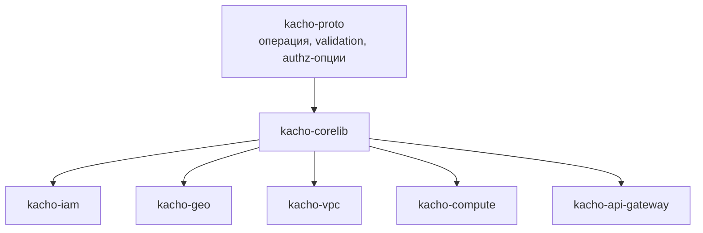
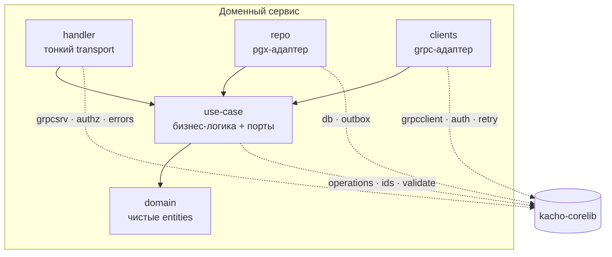

# Обзор архитектуры

Эта страница объясняет **место corelib в архитектуре платформы**: где библиотека стоит в
build-графе, как её пакеты ложатся на слои чистой архитектуры каждого сервиса и какие
границы она не пересекает. Reference по каждому пакету — в разделе
[Пакеты](/packages/overview); здесь — картина целиком.

## Место в build-графе

Платформа Kachō — полирепозиторий. corelib — **промежуточный слой**: он зависит только от
`kacho-proto` (сгенерированные stubs универсальных контрактов) и внешних библиотек, а от
него зависят все доменные сервисы. Обратной зависимости нет — corelib ничего не знает про
конкретные домены.

Правило отбора кода: горизонтальное (нужное 2+ сервисам) живёт в corelib; доменная
бизнес-логика (ref-валидация VPC, reconciler Compute) — в сервисе. Один потребитель — код
остаётся в сервисе, пока не понадобится второму.

## Чистая архитектура сервиса и роль corelib

Каждый доменный сервис построен по строгому dependency rule: `handler → use-case →
domain`, а `repo`/`clients` — адаптеры, реализующие порты use-case. corelib предоставляет
**инфраструктуру для каждого слоя**, не проникая в доменную логику.

<table>
  <thead><tr><th>Слой сервиса</th><th>Пакеты corelib</th></tr></thead>
  <tbody>
    <tr><td><strong>handler</strong> (transport)</td><td><a href="/packages/grpcsrv">grpcsrv</a> (mTLS, principal-extract), <a href="/packages/authz">authz</a> (per-RPC Check), <a href="/packages/errors">errors</a> (формат ответа)</td></tr>
    <tr><td><strong>use-case</strong> (бизнес-логика)</td><td><a href="/packages/operations">operations</a> (LRO), <a href="/packages/ids">ids</a>, <a href="/packages/validate">validate</a>, <a href="/packages/filter">filter</a>/selector</td></tr>
    <tr><td><strong>repo</strong> (pgx-адаптер)</td><td><a href="/packages/db">db</a> (пул + транзактор), <a href="/packages/outbox">outbox</a> (события в TX)</td></tr>
    <tr><td><strong>clients</strong> (grpc-адаптер)</td><td><a href="/packages/grpcclient">grpcclient</a> (mTLS-dial), <a href="/packages/authz">auth</a> (principal-propagation), <a href="/packages/resilience">retry</a>/backoff</td></tr>
    <tr><td><strong>cmd</strong> (composition root)</td><td><a href="/packages/observability">config · observability · shutdown</a>, сборка worker'ов и drainer'ов</td></tr>
  </tbody>
</table>

:::note corelib не тянет за собой транспорт в domain
domain-слой сервиса импортирует только stdlib и `kacho-proto`. corelib-пакеты с pgx/grpc
(`db`, `grpcsrv`, `outbox`) используются в адаптерах и composition root, а не в чистом
domain. Так dependency rule чистой архитектуры не нарушается.
:::

## Границы, которые corelib держит

- **Database-per-service.** corelib даёт пул и транзактор, но не «общую БД»: каждый сервис
  владеет своей схемой. Within-service инварианты выражаются DDL (FK/UNIQUE/EXCLUDE/CHECK/
  CAS), а corelib маппит SQLSTATE в gRPC-коды через [`errors`](/packages/errors).
- **Async-мутации через Operation.** [`operations`](/packages/operations) кодирует
  контракт «мутация возвращает `Operation`, клиент поллит» — без брокера, на durable-
  таблице + in-process worker.
- **Без брокера.** Cross-service доставка событий — транзакционный
  [`outbox`](/packages/outbox) + LISTEN/NOTIFY, а не Kafka/NATS.
- **AuthN+AuthZ на каждом RPC.** [`grpcsrv`](/packages/grpcsrv) +
  [`authz`](/packages/authz) обеспечивают mTLS и per-RPC Check на **обоих** listener'ах;
  internal-периметр не считается доверенным.

## Тестируемость

Пакеты corelib разделены на **unit** (без внешних зависимостей: `ids`, `validate`,
`errors`, `filter`, `safeconv`, `backoff`, `retry`, `shutdown`, `baggage`) и
**integration** (поднимают Postgres через testcontainers: `db`, `operations`, `outbox`,
`grpcsrv`). Такое деление зеркалит пирамиду тестов сервиса: use-case тестируется unit'ом
через порты, а adapter'ы (repo поверх `db`/`outbox`) — integration'ом.

## Дальше

- Осознанные проектные решения и известные ограничения —
  [Проектные решения](/architecture/design-decisions).
- Reference по каждому пакету — [Обзор пакетов](/packages/overview).
