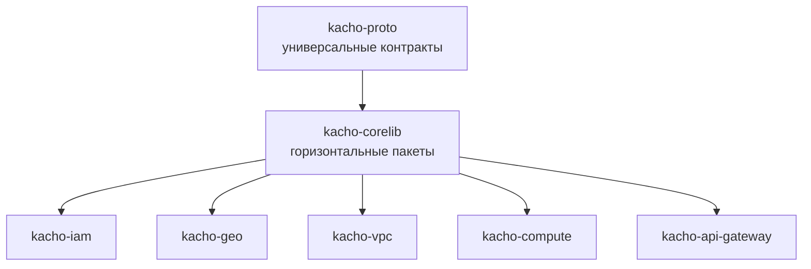

import hero from '@site/src/css/hero.module.css'

<header className={hero.hero}>
   Foundation · Shared Go packages

  <h1 className={hero.title}>
    Общая основа сервисов 
    Kachō
  </h1>

  

    <strong>kacho-corelib</strong> — библиотека переиспользуемых горизонтальных
    Go-пакетов платформы: генерация id, формат ошибок, пул Postgres, long-running
    operations, транзакционный outbox, mTLS-транспорт и авторизация. Всё
    инфраструктурное, что нужно двум и более сервисам, — в одном месте.
  

  

    <a className={hero.btnPrimary} href="/getting-started">Быстрый старт →</a>
    <a className={hero.btnGhost} href="/packages/overview">Обзор пакетов</a>
    <a className={hero.btnGhost} href="/architecture/overview">Архитектура</a>
    <a className={hero.btnGhost} href="https://github.com/PRO-Robotech/kacho-corelib">GitHub</a>
  

</header>

## Что это и зачем

**Kachō Corelib** — не сервис, а **библиотека**. Здесь нет исполняемых бинарей, нет
HTTP/gRPC-эндпоинтов и нет доменной бизнес-логики (она остаётся в репозиториях
сервисов — IAM, VPC, Compute, Geography, Network Load Balancer). В corelib живёт
только **горизонтальное**: код, который иначе пришлось бы копировать в каждый сервис.

Бизнес-ценность проста и измерима: **один источник истины для инфраструктурного
кода**. Формат id ресурса, тексты ошибок, дисциплина транзакций, семантика
long-running operations, правила mTLS — определены ровно один раз. Меняется контракт
→ правится один пакет, а не N сервисов вразнобой. Это устраняет дрейф между сервисами
и делает поведение платформы предсказуемым: `NetworkService` и `InstanceService`
одинаково генерируют id, одинаково возвращают `NOT_FOUND`, одинаково поллятся через
`Operation`.

API следует **конвенциям Kachō**: плоские (flat) ресурсы, id вида
`<3-char prefix><17-char crockford-base32>`, единый формат ошибок `google.rpc.Status`,
асинхронные мутации через `Operation`, database-per-service. Эти конвенции не
описываются в каждом сервисе заново — они **закодированы** в corelib.

:::info Библиотека, а не сервис
У corelib нет своего процесса, порта или базы данных. Пакеты подключаются
`go get` и вызываются из composition root каждого сервиса (`cmd/<svc>/main.go`). Эта
документация — reference по пакетам и их API, а не по развёртыванию сервиса.
:::

:::tip С чего начать
Новому читателю — [**Быстрый старт**](/getting-started): подключение модуля, генерация
первого id, запуск фоновой операции. Затем — [Обзор пакетов](/packages/overview)
(карта библиотеки) и [Архитектура](/architecture/overview) (как corelib встроен в
чистую архитектуру сервиса).
:::

## Карта пакетов

Библиотека сгруппирована по назначению. Каждый пакет узкий, самодостаточный и покрыт
тестами.

<table>
  <thead><tr><th>Группа</th><th>Пакеты</th><th>Назначение</th></tr></thead>
  <tbody>
    <tr>
      <td><strong>Идентификаторы и валидация</strong></td>
      <td><code>ids</code> · <code>validate</code> · <code>errors</code> · <code>filter</code> · <code>safeconv</code></td>
      <td>Генерация id ресурсов, field-level валидация входов, builder gRPC-ошибок, разбор list-фильтров, безопасные числовые конверсии</td>
    </tr>
    <tr>
      <td><strong>Данные и асинхронность</strong></td>
      <td><code>db</code> · <code>operations</code> · <code>outbox</code> · <code>migrations/common</code></td>
      <td>Пул pgx + транзактор, long-running operations (LRO), транзакционный outbox, общие goose-миграции</td>
    </tr>
    <tr>
      <td><strong>Транспорт и безопасность</strong></td>
      <td><code>grpcsrv</code> · <code>grpcclient</code> · <code>authz</code> · <code>auth</code></td>
      <td>Сборка gRPC-сервера/клиента (mTLS fail-closed, keepalive), authz-интерсептор (PDP-клиент + кэш), перенос principal</td>
    </tr>
    <tr>
      <td><strong>Рантайм сервиса</strong></td>
      <td><code>config</code> · <code>observability</code> · <code>shutdown</code> · <code>retry</code> · <code>backoff</code> · <code>baggage</code></td>
      <td>Загрузка конфигурации из окружения, slog + OTel, graceful-shutdown, retry/backoff идемпотентных вызовов, перенос observability-контекста в worker</td>
    </tr>
  </tbody>
</table>

Постраничный справочник — [Обзор пакетов](/packages/overview) и страницы каждого
пакета в сайдбаре слева.

## Кто и как использует corelib

corelib — **промежуточный слой** build-графа: он зависит только от `kacho-proto`
(сгенерированные stubs универсальных контрактов — operation, validation, authz-options)
и от stdlib/pgx/grpc, а от него зависят **все** доменные сервисы.

Правило простое: горизонтальный код (нужный 2+ сервисам) живёт **здесь**, а не
дублируется по репозиториям. Доменная бизнес-логика (ref-валидация VPC, reconciler
Compute) остаётся в сервисе. Подробнее — [Архитектура](/architecture/overview).

## Ключевые возможности

  

    #
    Единый формат id
    <code>ids.NewID(prefix)</code> — 3-символьный префикс домена + 17 символов crockford-base32 от <code>crypto/rand</code>.
  

  

    ⚑
    Стабильные ошибки
    Builder <code>errors</code> → <code>google.rpc.Status</code> с <code>BadRequest</code>/<code>ResourceInfo</code>; тексты — часть контракта.
  

  

    ⟳
    Long-running operations
    Durable-таблица + bounded worker-pool + reconciler-восстановление после рестарта. Каждая мутация → <code>Operation</code>.
  

  

    ⇄
    Транзакционный outbox
    Событие пишется в той же TX, что и мутация; drainer доставляет at-least-once с классификацией poison.
  

  

    🔒
    mTLS fail-closed
    <code>grpcsrv</code>/<code>grpcclient</code> — secure-by-default: нулевое значение конфигурации не открывает незащищённый транспорт молча.
  

  

    ✓
    Per-RPC авторизация
    <code>authz</code>-интерсептор: PDP-клиент к <code>InternalIAMService.Check</code>, кэш решений, fail-closed, rate-limit denied-storm.
  

## Технологический стек

<table>
  <thead><tr><th>Технология</th><th>Применение</th></tr></thead>
  <tbody>
    <tr><td>Go 1.25+</td><td>Язык реализации; generics (<code>operations.MetadataFor[T]</code>, <code>authz</code> list-objects)</td></tr>
    <tr><td>pgx v5 / pgxpool</td><td>Доступ к Postgres (без ORM): пул, транзактор, outbox, LRO-репозиторий</td></tr>
    <tr><td>gRPC / mTLS</td><td>Транспорт service→service; credentials, keepalive, cert-identity, principal-extract</td></tr>
    <tr><td>Protocol Buffers (<code>kacho-proto</code>)</td><td>Универсальные контракты: <code>operation.v1</code>, validation- и authz-опции</td></tr>
    <tr><td>OpenFGA (ReBAC)</td><td>Авторизация — <code>authz</code>-интерсептор вызывает PDP в kacho-iam</td></tr>
    <tr><td>Goose</td><td>Общие миграции (<code>migrations/common</code> — таблица operations)</td></tr>
    <tr><td>OpenTelemetry / slog</td><td>Телеметрия и структурированное логирование (<code>observability</code>)</td></tr>
  </tbody>
</table>

## Структура репозиториев

<table>
  <thead><tr><th>Репозиторий</th><th>Назначение</th></tr></thead>
  <tbody>
    <tr><td><strong>kacho-corelib</strong></td><td>Эта библиотека: горизонтальные Go-пакеты платформы</td></tr>
    <tr><td><strong>kacho-proto</strong></td><td>Центральные <code>.proto</code> + сгенерированные Go-stubs (единственная build-зависимость corelib)</td></tr>
    <tr><td><strong>kacho-iam / kacho-geo / kacho-vpc / kacho-compute</strong></td><td>Доменные сервисы — потребители corelib</td></tr>
    <tr><td><strong>kacho-api-gateway</strong></td><td>Edge: gRPC-proxy + REST mux — тоже потребитель corelib</td></tr>
  </tbody>
</table>
