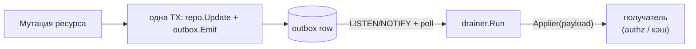

# outbox

Пакет `outbox` решает задачу **надёжной доставки события об изменении без брокера и без
потери интента**. Когда сервис меняет ресурс, часто нужно сообщить об этом другой стороне
(например, записать owner-tuple в авторизацию, инвалидировать кэш). Если писать событие
отдельным вызовом после коммита мутации — оно может потеряться при падении между двумя
операциями. Транзакционный outbox устраняет разрыв: событие пишется **той же
транзакцией**, что и мутация, а фоновый drainer доставляет его получателю at-least-once,
отделяя транзиентные сбои от «отравленных» (poison) сообщений.



## Writer — запись события в TX

<table>
  <thead><tr><th>Символ</th><th>Назначение</th></tr></thead>
  <tbody>
    <tr><td><code>Emit(ctx, tx pgx.Tx, table, kind, id, eventType string, payload map[string]any) error</code></td><td>INSERT события в <code>&lt;schema&gt;.outbox</code>. <strong>Требует</strong> <code>tx</code> — атомарность с мутацией это точка дизайна</td></tr>
    <tr><td><code>SanitizeTable(table string) string</code></td><td>Нормализует имя целевой таблицы (защита от инъекции в identifier)</td></tr>
  </tbody>
</table>

```go
err := tx.InTx(ctx, func(tx pgx.Tx) error {
    if err := repo.UpdateNetwork(ctx, tx, n); err != nil {
        return err
    }
    return outbox.Emit(ctx, tx, "networks", "network", n.ID, "network.updated",
        map[string]any{"id": n.ID, "name": n.Name})
})
// Либо оба закоммичены, либо ни одного. NOTIFY уходит асинхронно после commit.
```

## Drainer — доставка at-least-once

`outbox/drainer` — **generic** потребитель outbox-таблицы. Он атомарно «забирает» строки
(CAS-claim `FOR UPDATE SKIP LOCKED`), декодирует payload, применяет через доменный
`Applier` и помечает результат. Тип payload параметризуется (`Drainer[T]`).

<table>
  <thead><tr><th>Символ</th><th>Назначение</th></tr></thead>
  <tbody>
    <tr><td><code>New[T]&#40;pool, cfg, dec Decoder[T], app Applier[T], log, opts…) (*Drainer[T], error)</code></td><td>Создать drainer для конкретного типа события</td></tr>
    <tr><td><code>(*Drainer[T]).Run(ctx) error</code></td><td>Блокирующий цикл: startup catch-up → LISTEN/NOTIFY + poll-fallback → claim-batch → apply → mark</td></tr>
    <tr><td><code>Decoder[T] func(payload []byte) (T, error)</code></td><td>Разбор JSON-payload события</td></tr>
    <tr><td><code>Applier[T] func(ctx, eventType string, payload T) error</code></td><td>Доменное применение события к получателю</td></tr>
    <tr><td><code>Config</code></td><td><code>Table</code>, <code>Channel</code>, <code>BatchSize</code> (32), <code>PollFallback</code> (30s), <code>MaxAttempts</code> (10), <code>BackoffMin/Max</code>, <code>ApplyTimeout</code></td></tr>
    <tr><td><code>Classify(err) Class</code></td><td>Классификация ошибки Applier: idempotent / transient / permanent</td></tr>
  </tbody>
</table>

### Семантика ошибок Applier

<table>
  <thead><tr><th>Возврат Applier</th><th>Действие drainer</th></tr></thead>
  <tbody>
    <tr><td><code>nil</code></td><td><code>markSuccess</code> (доставлено)</td></tr>
    <tr><td><code>errors.Is(err, ErrAlreadyApplied)</code></td><td><code>markSuccess</code> — получатель уже применил (идемпотентно)</td></tr>
    <tr><td><code>errors.Is(err, ErrPermanent)</code></td><td><code>markPoisoned</code> — отравленная строка, не ретраить</td></tr>
    <tr><td>прочее (transient)</td><td><code>markFailure</code> + экспоненциальный backoff на следующей итерации</td></tr>
  </tbody>
</table>

:::warning At-least-once: transient никогда не отравляет
Транзиентный сбой (получатель `Unavailable`) кэпит `attempt_count` ниже poison-порога —
чтобы длительный outage сам по себе не «отравил» интент и не потерял событие. Poison — это
**только** явный `ErrPermanent`. Claim-порядок — `ORDER BY attempt_count, id` (свежие
идут первыми): иначе backlog застрявших строк с высоким attempt_count навсегда затеняет
свежие интенты (head-of-line starvation), нарушая at-least-once.
:::

## Reconciler и bootgate — целостность outbox ↔ state

- `outbox/reconciler` — фоновая задача согласования: сверяет фактическое состояние
  ресурсов (`ResourceEnumerator`) с зарегистрированными записями (`TupleRegistry`),
  дозаписывает недостающие и убирает орфанов. Helpers `EmitRegister`/`EmitUnregister`
  пишут register/unregister-интент в TX.
- `outbox/bootgate` — fail-closed стартовый гейт: drainer/сервис не стартует, если outbox
  в несогласованном состоянии.
- `outbox/metrics` — счётчики drainer'а (claimed / applied / poisoned / backlog).

## Корнер-кейсы и лучшие практики

- **`Emit` всегда в TX мутации.** Вызов вне транзакции — ошибка; атомарность и есть
  причина существования пакета.
- **`Applier` обязан быть идемпотентным.** Доставка at-least-once → одно и то же событие
  может примениться повторно; получатель должен трактовать «уже применено» как успех
  (`ErrAlreadyApplied`).
- **Отличайте transient от permanent.** Верните `ErrPermanent` только для реально
  неисправимого payload; временную недоступность peer — как обычную ошибку (будет retry).
- **NOTIFY может потеряться** — drainer всё равно догонит через `PollFallback`; не
  полагайтесь на мгновенность.

## Импорты и зависимости

Top-level `outbox` — stdlib + `pgx/v5`. `outbox/drainer` — stdlib (`context`, `errors`,
`log/slog`, `time`, `crypto/rand`) + `pgx/v5` / `pgxpool`. Потребляется repo-слоем
(writer) и composition root (drainer/reconciler) сервисов; см. также
[operations](/packages/operations) и [db](/packages/db).
