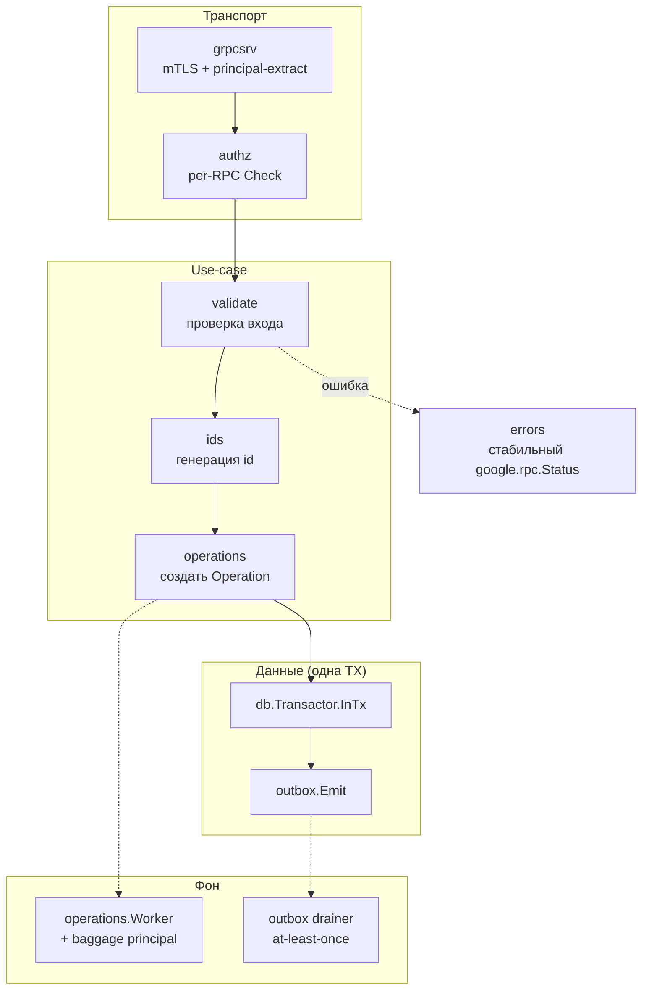

# Обзор пакетов

Эта страница — карта библиотеки: какие пакеты в ней есть, за что каждый отвечает и как
они сочетаются в типовом сервисе Kachō. Детальный reference по exported API — на
странице каждого пакета (сайдбар слева).

:::info Принцип отбора
В corelib попадает только **горизонтальное** — код, нужный двум и более сервисам. Один
потребитель → код остаётся в сервисе. Доменная бизнес-логика (ref-валидация VPC,
reconciler Compute) в corelib **не живёт** никогда.
:::

## Полный состав

<table>
  <thead><tr><th>Пакет</th><th>Назначение</th><th>Тесты</th></tr></thead>
  <tbody>
    <tr><td><a href="/packages/ids"><code>ids</code></a></td><td>Генерация и валидация id ресурсов: <code>&lt;3-char prefix&gt;&lt;17-char crockford-base32&gt;</code>, энтропия — <code>crypto/rand</code></td><td>unit</td></tr>
    <tr><td><a href="/packages/validate"><code>validate</code></a></td><td>Field-level валидаторы (имя, описание, labels, page-size, resource-id, IP) со стабильными текстами ошибок</td><td>unit</td></tr>
    <tr><td><a href="/packages/errors"><code>errors</code></a></td><td>Builder gRPC-статусов с <code>BadRequest</code>/<code>ResourceInfo</code>/<code>LocalizedMessage</code> деталями</td><td>unit</td></tr>
    <tr><td><a href="/packages/filter"><code>filter</code></a></td><td>Разбор list-фильтров (<code>name = "x"</code>) → AST → параметризованный SQL <code>WHERE</code> (без конкатенации значений)</td><td>unit</td></tr>
    <tr><td><a href="/packages/filter"><code>selector</code></a></td><td>Структурный builder pagination + seek-курсор + field-selectors → <code>WHERE/ORDER BY/LIMIT</code></td><td>unit</td></tr>
    <tr><td><a href="/packages/observability"><code>safeconv</code></a></td><td>Безопасные числовые конверсии с saturation (без тихого overflow-wrap)</td><td>unit</td></tr>
    <tr><td><a href="/packages/db"><code>db</code></a></td><td>Пул <code>pgx</code> (fail-fast Ping, <code>statement_timeout</code>) + транзактор (<code>InTx</code>, rollback на ошибке/панике)</td><td>integration</td></tr>
    <tr><td><a href="/packages/operations"><code>operations</code></a></td><td>Long-Running Operations: durable-таблица, bounded worker-pool, reconciler-восстановление, principal-перенос</td><td>integration</td></tr>
    <tr><td><a href="/packages/outbox"><code>outbox</code></a></td><td>Транзакционный outbox: writer (запись в одной TX), drainer (at-least-once, poison-классификация), reconciler</td><td>integration</td></tr>
    <tr><td><a href="/packages/grpcsrv"><code>grpcsrv</code></a></td><td>Сборка gRPC-сервера: mTLS-credentials (fail-closed), cert-identity, principal/ACR-extract с trust-границей, keepalive</td><td>integration</td></tr>
    <tr><td><a href="/packages/grpcclient"><code>grpcclient</code></a></td><td>Сборка gRPC-клиента: secure-by-default TLS, keepalive</td><td>unit</td></tr>
    <tr><td><a href="/packages/authz"><code>authz</code></a></td><td>PDP-клиент + gRPC-интерсептор авторизации (fail-closed, кэш решений, rate-limit, list-objects scope-filter)</td><td>unit</td></tr>
    <tr><td><a href="/packages/authz"><code>auth</code></a></td><td>Перенос caller-identity (principal) в outgoing gRPC-metadata; system-principal для service→service</td><td>unit</td></tr>
    <tr><td><a href="/packages/resilience"><code>retry</code></a></td><td>Retry-обёртки идемпотентных gRPC-вызовов по кодам (<code>Unavailable</code>/<code>Aborted</code>)</td><td>unit</td></tr>
    <tr><td><a href="/packages/resilience"><code>backoff</code></a></td><td>Экспоненциальный и постоянный backoff (builder с jitter и порогом elapsed)</td><td>unit</td></tr>
    <tr><td><a href="/packages/resilience"><code>shutdown</code></a></td><td>Graceful-shutdown manager: LIFO-handlers с per-handler timeout</td><td>unit</td></tr>
    <tr><td><a href="/packages/observability"><code>observability</code></a></td><td>Структурированный slog-логгер + инициализация OpenTelemetry</td><td>unit</td></tr>
    <tr><td><a href="/packages/observability"><code>config</code></a></td><td>Загрузка конфигурации сервиса из окружения (fail на missing required)</td><td>unit</td></tr>
    <tr><td><a href="/packages/observability"><code>baggage</code></a></td><td>Перенос observability-значений (trace/slog) в worker-context без наследования cancel/deadline</td><td>unit</td></tr>
    <tr><td><code>migrations/common</code></td><td>Встроенные goose-миграции общих таблиц (operations); каждый сервис владеет своей копией DDL</td><td>—</td></tr>
  </tbody>
</table>

## Как пакеты сочетаются в сервисе

Типовой доменный сервис Kachō собирает эти пакеты в composition root
(`cmd/<svc>/main.go`) и распределяет их по слоям чистой архитектуры. Ниже — путь одного
запроса на мутацию.

- **grpcsrv** принимает запрос по mTLS, извлекает principal и ACR.
- **authz** гейтит каждый RPC через PDP (`InternalIAMService.Check`), fail-closed.
- **validate** проверяет вход; при нарушении **errors** формирует стабильный ответ.
- **ids** выдаёт id ресурса; **operations** создаёт `Operation` и возвращает её синхронно.
- **db.Transactor** пишет мутацию и **outbox**-событие одной транзакцией.
- **operations.Worker** выполняет работу в фоне (principal перенесён через **baggage**);
  **outbox drainer** доставляет событие потребителю at-least-once.

## Зависимости библиотеки

corelib зависит только от `kacho-proto` (сгенерированные stubs универсальных
контрактов) и внешних библиотек (`pgx`, `grpc`, `otel`, `slog`). От доменных сервисов
он **не** зависит — это промежуточный слой build-графа. Подробнее о слоях —
[Архитектура](/architecture/overview).
